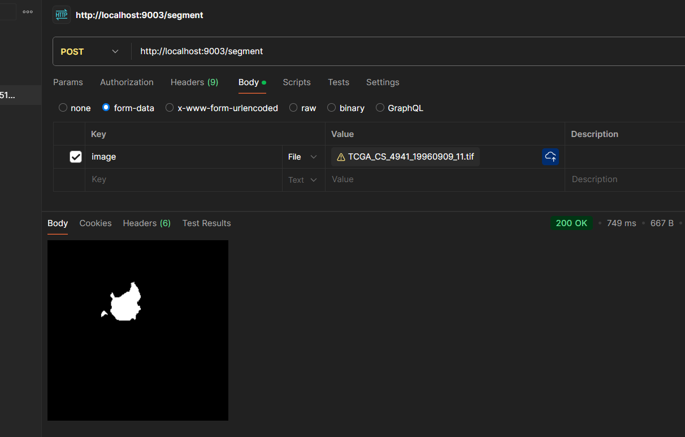

# Brain MRI Segmentation with U-NET

This project segments the different tumor parts inside the brain using the U-Net architecture

## Table of Contents

- [Information about the project](https://github.com/Abdelrahman-ammar/Brain-Tumor-Segmentation-UNET/blob/master/README.md#What-is-this-project)

- [Project Structure](https://github.com/Abdelrahman-ammar/Brain-Tumor-Segmentation-UNET/blob/master/README.md#Project-Structure)

### Information about the Project

The project does segmentation on different parts of the brain , thus generating masks for the tumor if it exists , rather than that it will give a black mask indicating no tumor , you can find the dataset here : [Kaggle/Datasets](https://www.kaggle.com/datasets/masoudnickparvar/brain-tumor-mri-dataset) , the model was trained using custom loss functions like IOU , Dice Coef and Dice loss

## Project Structure

- [Notebooks](./Notebooks/) : Project Notebooks where training and testing has been done

- [Models](./Models/) : The encoder , decoder and the entilre model files is there , there is also another version of the model but only weights is saved , you can use `load_weights` function from tensorflow to lload the model weights into your model structure

- [Deployment](./Deployment/) : The Deployment was made using 2 methods , Docker file and Flask application

  - [Dockerfile](./Deployment/Dockerfile) : build the docker file from here using the command `docker build -t brain_segmentation:v1.0 .` (notice that you should be placed in the deployment directory for the command to work) , then you could run the container using `docker run -it -p 9003:9003 brain_segmentation:v1.0` ,by doing this you could send a request , curl a post request on this specific port.

  - [Flask App](./Deployment/app.py) : or you can just `pip install -r requirements.txt` and then use `python app.py` to run the flask application

## Notes:

before running the dockerfile , or the docker command , you should put the segmentation model along aside the app.py in the same directory and don't forget to change the model path in the app.py file.

# Demo:

---

